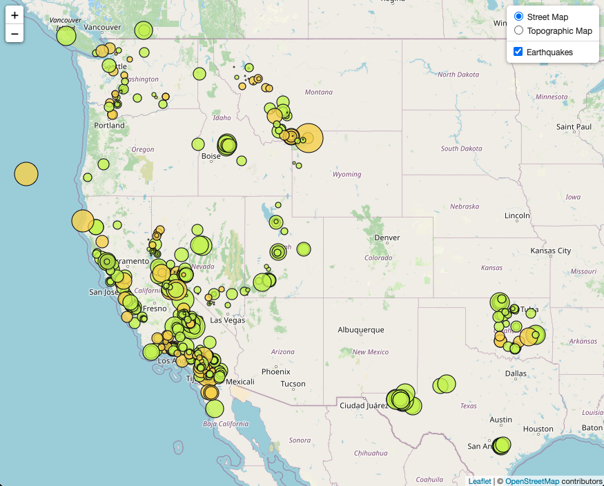
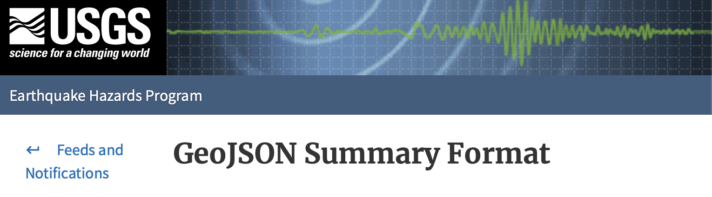
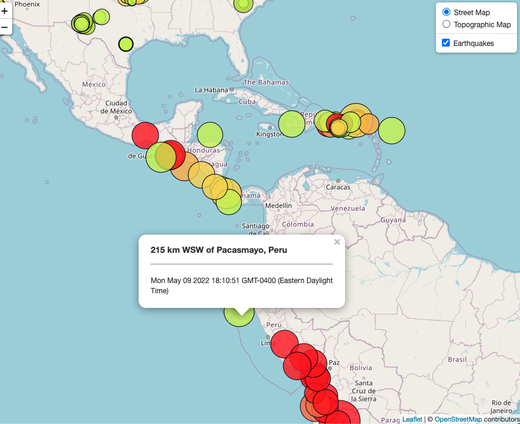
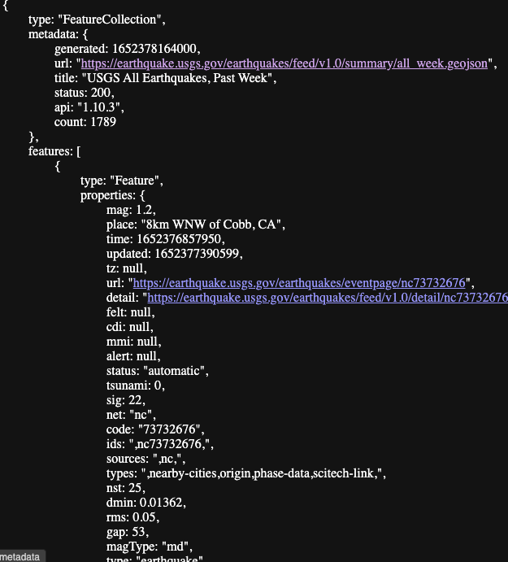
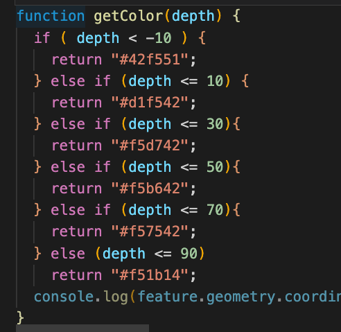
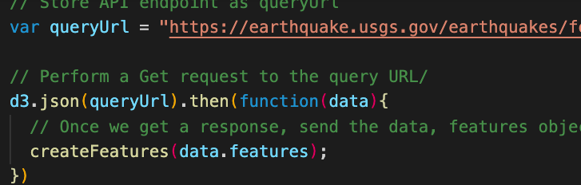
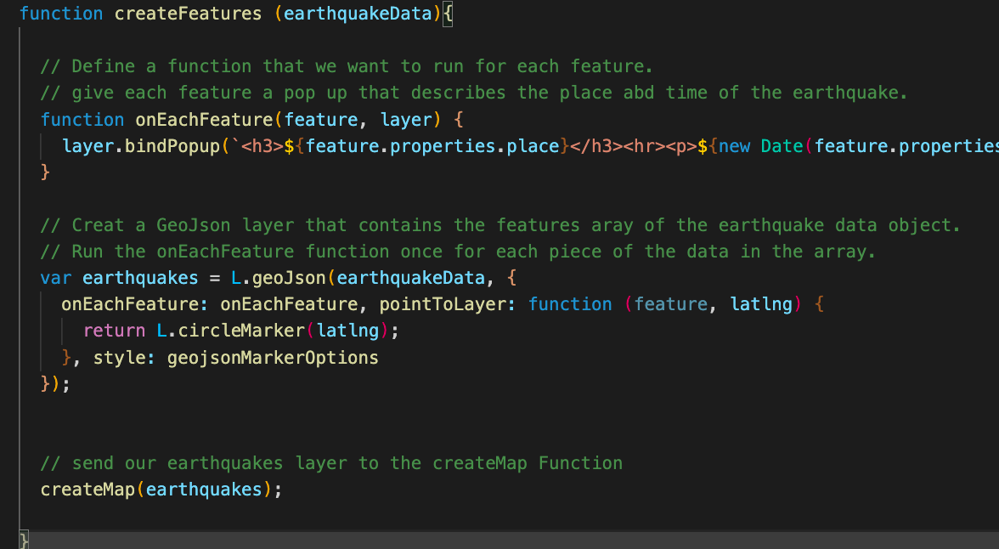

# GEO Mapping - Leaflet

Use EarthQuake data to plot points on a  Map.



## Table of Contents
* [General info](#general-info)
* [Technologies](#Technologies)
* [Set up](#set-up)
* [Features](#Features)


## General info
Go in depth with leaflet. Learn about one of the foundations of data, Maps! Geo Mapping dives into plotting coordinates, changing markers and creating pop-ups. Leaflet uses Javascript to effeciantly and smoothly map objects. Creates an easy to read, intuitive way to display information.



## Technologies
* Leaflet
* Javascript
* css
* HTML
* USGS API

## Set Up
To run this project install it locally:
navigate into diractory, start local server
```
$ cd /leaflet-challenge/Leaflet-Step-1/StarterCoder
$ python -m http.server

```

## Features
USGS Geo Json


Function that changes circle color


Using D3 call to Geo Json


GeoMapping plot the markers



